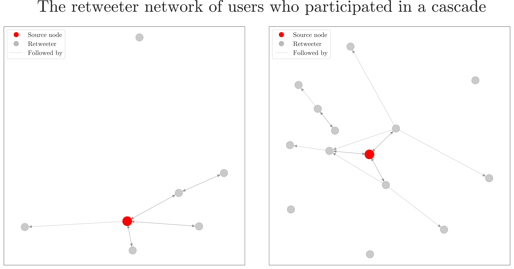

# Information diffusion on 𝕏 (formerly Twitter): a model comparison approach
1. Builds social network graphs using NetworkX, Python.
2. Investigates information diffusion using epidemiological models.
3. Models the life-cycle of a tweet.
4. Employs OpenAI API for identifying tweets' topics.
5. Writes a 50-page scientific report with 50+ citations using LaTeX.

## Executive Summary
**Objective:** Build a model to predict a tweet's potential outreach and its temporal life-cycle, compare different topics, more and less influential users, uncover other factors contributing to a tweet's virality.

**Methodology:** Start with a simple model, gradually add new parameters and more realistic assumption, compare each time with the more primitive model. Use OpenAI API to identify tweet topics.

**Recommendations:** Contrary to common perception, most popular tweets are not viral, but broadcast events. The use of epidemiological models are discouraged. The first two hours of a tweet are vital. LLMs are a good alternative NLP method.

This repository hosts the code and manuscript of my master's thesis project with the abovementioned title.

## Abstract (Scientific)
The application of network science principles provides a comprehensive understanding of a broad range of complex systems. X (formerly known as Twitter), a popular online microblogging platform, is one such information system where users are connected with follower relationships and information is conveyed between users. In this study, I investigate the diffusion of information by comparing basic mathematical models and compartmental models borrowed from epidemiology to account for the virality claims on Twitter, which is a colloquially shared concept between diseases and social media. Results showed that compartmental models are not especially good at explaining the reach of a tweet, but are open for improvement. The temporal course of a tweet was well captured with a logarithmic function. Models used in this study are compared, and relation to neuroscience research are discussed.

Keywords: information diffusion, Twitter, X, network analysis, SIR, social network, Independent Cascade

## Author and Contact
**Author:** Ekin Derdiyok  
**Email:** ekin.derdiyok@icloud.com  
**Github:** https://github.com/ekinderdiyok/information-diffusion-on-twitter  
**Affiliation:** M.Sc. in Cognitive Neuroscience (MCNB), Fachbereich Erziehungswissenschaft und Psychologie, Freie Universität Berlin  
**Date:** April 29, 2024 (Submission date)  

## Acknowledgements
I would like to express my sincere gratitude to my primary supervisor, Dr. Philipp Lorenz-Spreen, for accepting me as an intern. I am also deeply thankful to Prof. Felix Blankenburg for his interest in the topic and for co-supervising my thesis. A special thanks go to the Max Planck Institute for Human Development for providing me with the opportunity to conduct my internship. I extend my appreciation to Dr. Timo Torsten Schmidt for his guidance and mentorship during the second year. Lastly, I would like to express my gratitude to all the lecturers of the Master Cognitive Neuroscience Berlin (MCNB) program and all the staff at the Department of Education and Psychology at Freie Universität Berlin.

## How to contribute?
Have a look at the *Future Directions* in `text/information-diffusion-on-twitter.pdf` and see if you would like to keep on working the project.
